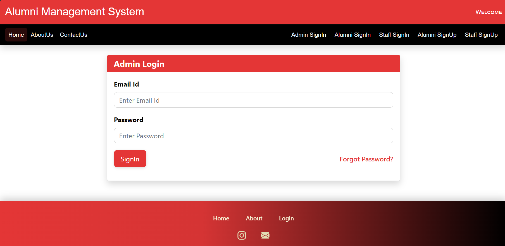
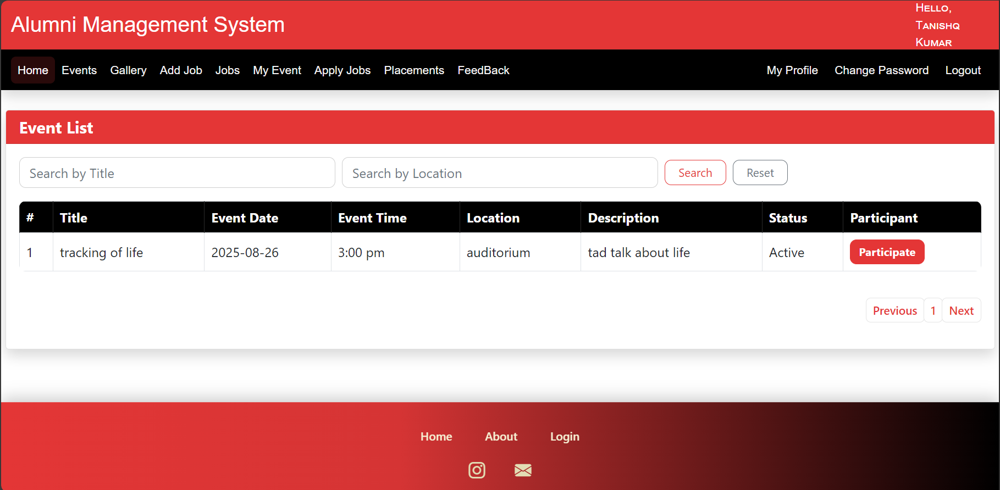
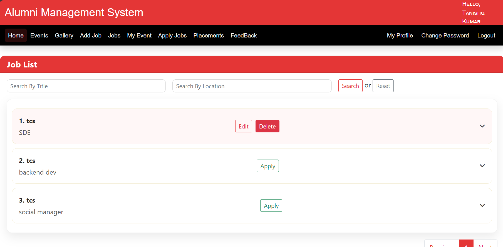
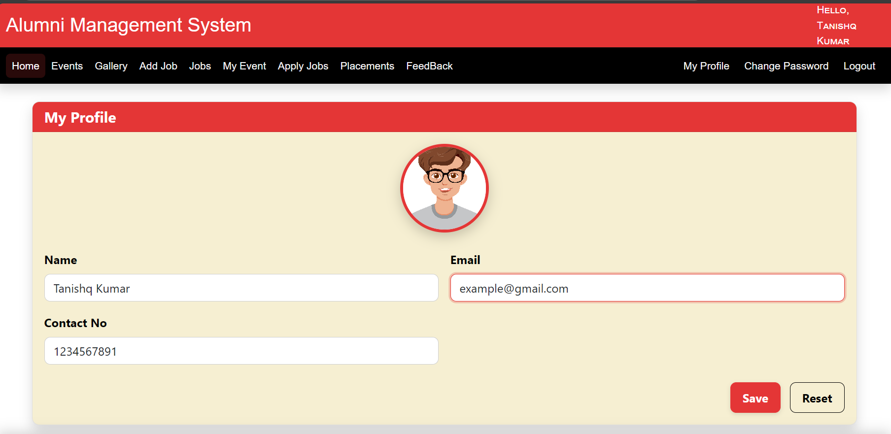
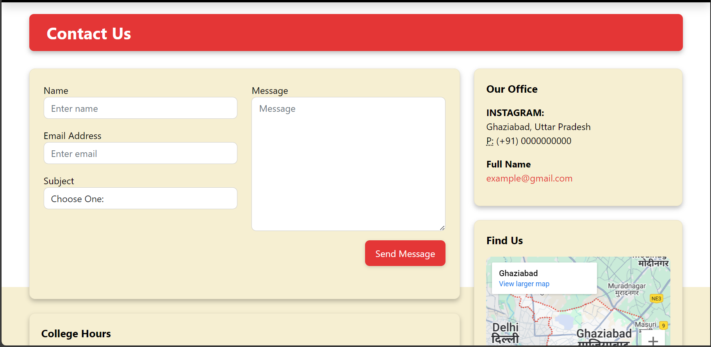

# Alumni Management System (Spring Boot + JSP + MySQL)

A classic MVC web application for managing alumni, staff, events, jobs, feedback, and more.

## Tech Stack
- Spring Boot 2.5.4
- Java 11
- Spring Data JPA (Hibernate) + MySQL
- JSP + JSTL + Tomcat (embedded)

## Quick Start
```bash
# 1) Clone
git clone <your-repo-url>.git
cd Alumni-Management-System

# 2) Configure environment
cp .env.example .env  # fill values

# 3) Generate application.properties from template (or set env using your IDE)
cp application.properties.template src/main/resources/application.properties

# 4) Run
./mvnw spring-boot:run
# Visit http://localhost:${SERVER_PORT:-8081}${SERVER_CONTEXT_PATH:-/AMS}
```

## Database
- Default dialect: MySQL 8
- DDL auto: `update` (dev only). Prefer migrations (Flyway/Liquibase) for production.

## 🗄 Database Setup

1. Create the schema:
   ```bash
   mysql -u root -p < docs/database/ams_schema.sql


## Modules / Features
- Admin, Alumni, Staff authentication (current build compares plaintext passwords in DAOs — **secure hashing recommended**).
- Events (create/list/participate)
- Jobs (create/apply)
- Feedback & Contact Us
- Profiles and Password change

## 📸 Screenshots

### Home Page


### Login Page


### Admin Dashboard


### Alumni Dashboard


### Events


### Jobs


### Profile


### Contact Us



## Endpoints
See [ENDPOINTS.md](ENDPOINTS.md) for a generated list of controller mappings.


## Security Notes
- No Spring Security at the moment; sessions managed manually via controllers.
- Replace plaintext password checks with BCrypt (`spring-boot-starter-security`) and a `PasswordEncoder`.
- Move secrets to environment variables; don't commit real credentials.

