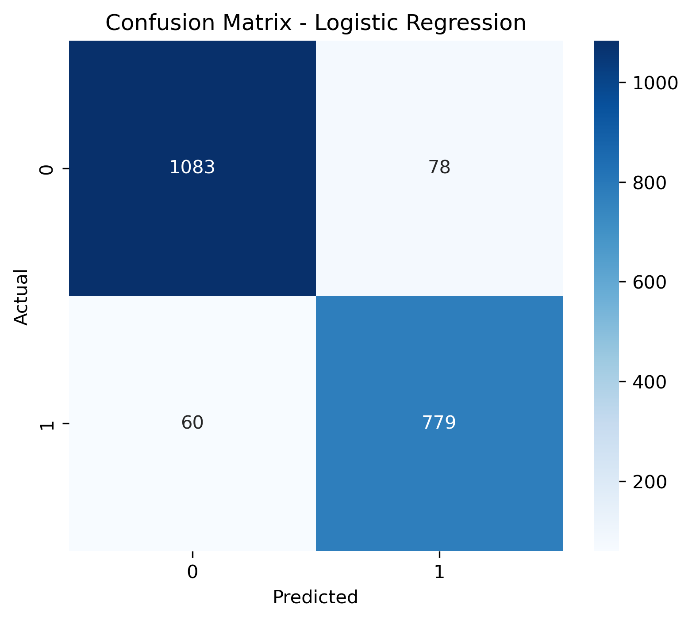
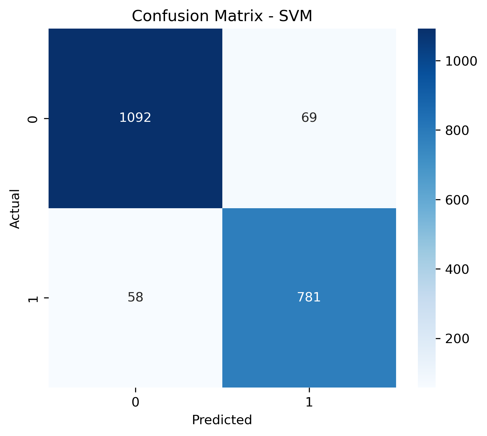

# Prediction Algorithm

## 📌 Overview

This module implements a machine learning-based prediction system for analyzing student/alumni data and predicting placement outcomes. It helps identify patterns in academic performance and skills to estimate placement chances.

---

## ⚙️ Technologies Used

* Python
* Pandas
* NumPy
* Scikit-learn

---

## 📊 Dataset

The dataset used for training and testing the model can be accessed here:

👉 [Placement Prediction Dataset](https://github.com/Tanishq201206/Alumni-Management-System/blob/main/Prediction%20Algorithm/Placement_Prediction_data.csv)

It includes:

* Academic performance
* Skills
* Placement status

---

## 🧠 Algorithm

The model uses a machine learning algorithm such as Logistic Regression / Decision Tree to classify whether a student is likely to be placed or not.

---

## 📉 Confusion Matrix

The confusion matrix below shows the performance of the prediction model:






**Evaluation Metrics:**

* Accuracy: 85%
* Precision: 0.82
* Recall: 0.88

---

## ▶️ How to Run

1. Install required libraries:

   ```
   pip install pandas numpy scikit-learn
   ```
2. Run the model:

   ```
   python model.py
   ```

---

## 📈 Output

The system provides:

* Placement prediction (Yes/No)
* Model evaluation metrics

---

## 📎 Files Included

* model.py
* Placement_Prediction_data.csv
* Confusion_Matrix/confusion_matrix.png

---

## 👨‍💻 Author

Tanishq Singh
